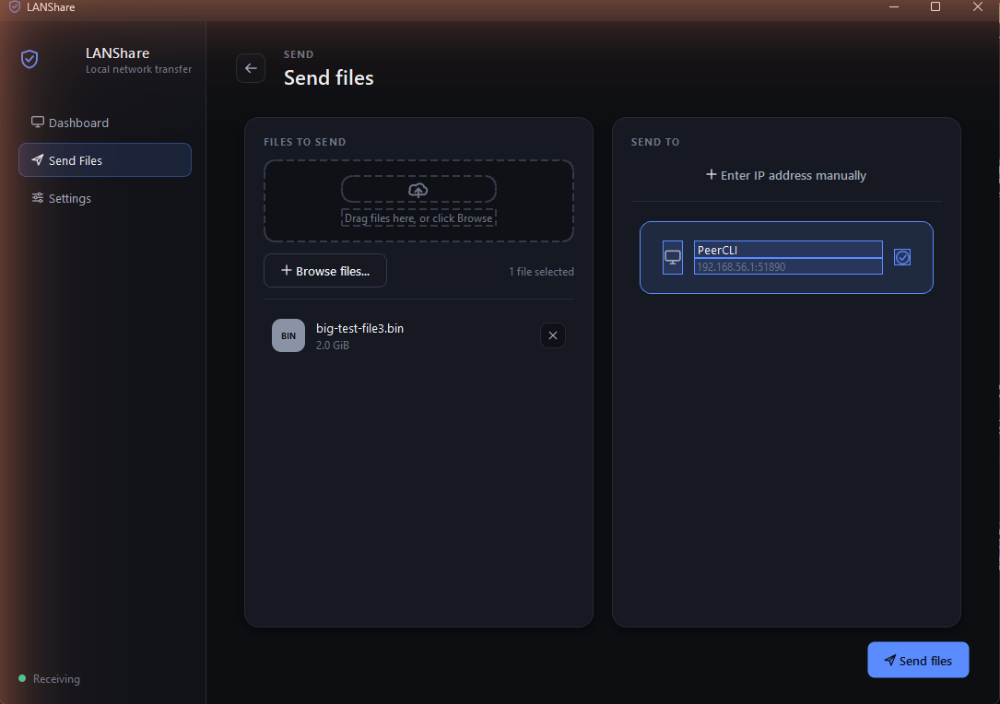
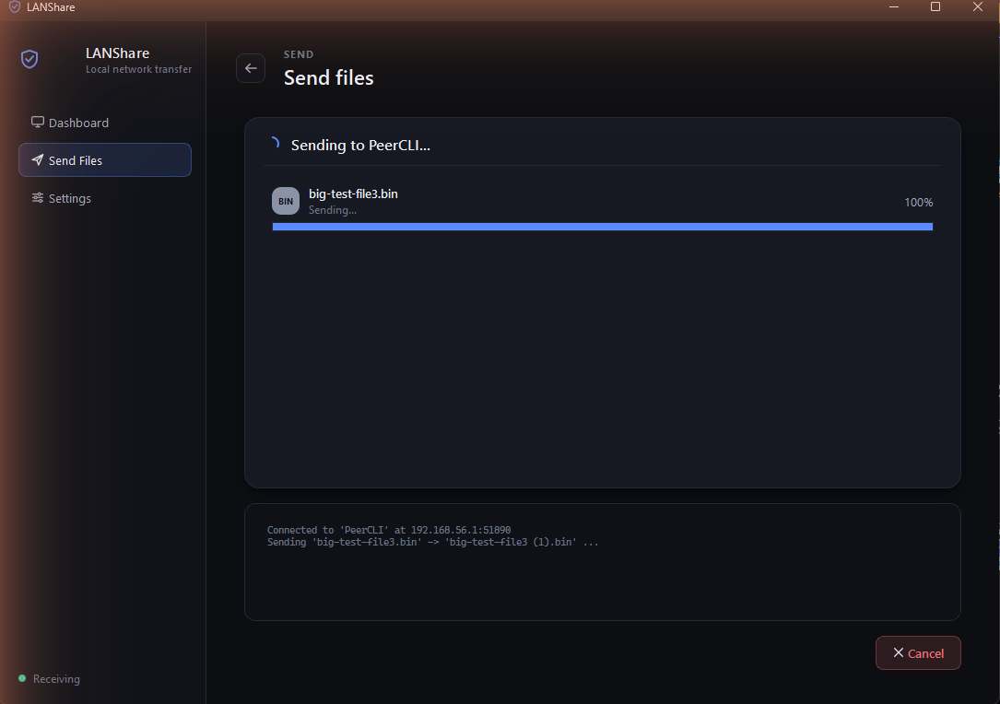
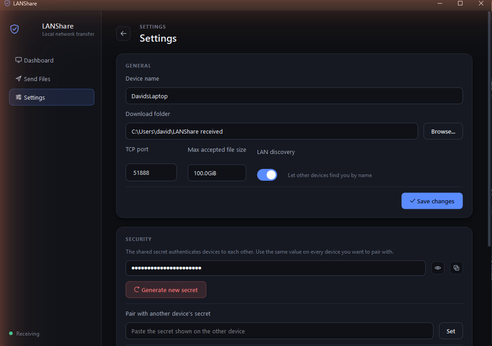

# LANShare

**Reasonably secure, cross-platform file sharing for devices on the same local network.**
Works in every direction — Windows → Linux, Linux → Windows, Linux → Linux, Windows → Windows —
as long as both machines share a Wi-Fi network or LAN. Comes with both a desktop GUI and a
scriptable CLI, built on the same encrypted, authenticated transfer engine.

<p align="center">
  
</p>

## Why

Dropping a file onto another machine on your own network shouldn't require a cloud account,
a USB stick, or emailing it to yourself. LANShare sends files directly, peer-to-peer, over
your LAN — encrypted, authenticated, and only after the receiving side explicitly approves it.

## Screenshots

<table>
  <tr>
    <td><br><sub align="center">Pick files and a target device</sub></td>
    <td><br><sub>Every transfer needs approval</sub></td>
  </tr>
  <tr>
    <td><br><sub>Live progress, speed, and logs</sub></td>
    <td><br><sub>Pairing, ports, and security settings</sub></td>
  </tr>
</table>

## Security model

Every transfer is:

- **Encrypted** with TLS 1.2+ (TLS 1.3 when both ends support it), using a persistent
  self-signed identity certificate generated per device.
- **Authenticated** in both directions with a shared secret via an HMAC challenge-response
  bound to the TLS certificate fingerprint (channel binding), so a man-in-the-middle can't
  relay a session.
- **Approved by a human** on the receiving device before a single byte is written.
- **Restricted to the local network** — connections from routable/public IP addresses are refused.
- **Written safely** — file names are sanitized, sizes are checked against a limit and against
  free disk space, and files can only ever land inside the configured download directory
  (no path traversal, no silent overwrites).

See [Security model in depth](#security-model-in-depth) below for the full threat model and honest limitations.

## Install

Requires Python 3.8+.

```bash
git clone https://github.com/davidrencse/lan-file-share.git
cd lan-file-share
pip install -r requirements.txt          # CLI only
pip install -r requirements-gui.txt      # CLI + desktop GUI
```

> **Arch / other externally-managed Python:** create a venv first —
> `python -m venv .venv && source .venv/bin/activate` — then install as above.

Optionally install the `lanshare` command itself:

```bash
pip install .            # CLI
pip install ".[gui]"     # CLI + GUI
```

## Quick start (GUI)

```bash
python -m lanshare gui
```

1. On first launch, LANShare generates this device's identity and a **shared secret**.
   Open **Settings** to copy it.
2. On the other device, launch LANShare too, open **Settings → Pair with another device's
   secret**, and paste the value from step 1.
3. On the device that should *receive*, flip the **Receiving** toggle on the Dashboard.
4. On the sending device, click **Send Files**, pick files and a target (devices on the LAN
   show up automatically), and hit **Send**.
5. The receiving device gets an approval dialog for every file — nothing is written without
   an explicit **Accept**.

## Quick start (CLI)

On device **A**:

```bash
lanshare init --name laptop-alice
```

This prints a freshly generated **shared secret**. On device **B**, use that same secret:

```bash
lanshare init --name desktop-bob
lanshare set-secret <the-secret-from-A>
```

Start receiving on B:

```bash
lanshare receive
```

Send from A:

```bash
lanshare discover                          # optional: find devices by name
lanshare send 192.168.1.42 ./report.pdf    # or: lanshare send desktop-bob --find ./report.pdf
```

B is prompted to accept or decline each file before anything is written to disk.

## CLI reference

| Command | Description |
|---|---|
| `lanshare init [--name NAME]` | Generate identity + a shared secret (first run). |
| `lanshare set-secret [SECRET]` | Set the shared secret (prompts if omitted). |
| `lanshare show-secret` | Print the current secret and this device's fingerprint. |
| `lanshare info` | Show configuration, paths, identity fingerprint, local IPs. |
| `lanshare config [--name --dir --port --max-size --discovery]` | View/change persistent settings. |
| `lanshare receive [--dir --port --name --no-discovery --yes]` | Run the receiver and wait for transfers. |
| `lanshare send TARGET FILE... [--port --find]` | Send file(s) to a receiver (IP, or name with `--find`). |
| `lanshare discover [--timeout N]` | List LANShare receivers on the network. |
| `lanshare gui` | Launch the desktop GUI. |
| `lanshare selftest` | Run a local loopback transfer to verify the install. |

## Cross-platform notes

- **Windows ↔ Linux both ways** are supported and tested; the wire protocol is OS-independent
  and file names are normalized safely for the receiving OS.
- **Firewall:** the receiver listens on TCP `51888` and answers UDP discovery on `51889`.
  - *Windows:* the first `lanshare receive` (or GUI "Receiving" toggle) usually triggers a
    Defender Firewall prompt — allow it on **Private** networks. Or, in an elevated PowerShell:
    ```powershell
    New-NetFirewallRule -DisplayName "LANShare" -Direction Inbound -Protocol TCP -LocalPort 51888 -Action Allow -Profile Private
    New-NetFirewallRule -DisplayName "LANShare discovery" -Direction Inbound -Protocol UDP -LocalPort 51889 -Action Allow -Profile Private
    ```
  - *Linux (ufw):*
    ```bash
    sudo ufw allow from 192.168.0.0/16 to any port 51888 proto tcp
    sudo ufw allow from 192.168.0.0/16 to any port 51889 proto udp
    ```
- **Discovery** relies on UDP broadcast, which some networks (guest Wi-Fi, client isolation,
  most corporate VLANs) block. If nothing shows up, send/connect by IP directly — that always
  works as long as the two machines can reach each other. Find a device's IP under its
  Dashboard, or with `lanshare info`.

## Where things are stored

| What | Windows | Linux/macOS |
|---|---|---|
| Config & identity | `%APPDATA%\LANShare` | `~/.config/lanshare` |
| Received files (default) | `~\LANShare received` | `~/LANShare received` |

Set `LANSHARE_HOME` to override the config directory (handy for running two instances on one
machine, as the tests do).

## Security model in depth

**Threat model:** other devices on the same LAN, including a malicious one that can see traffic
or try to connect to you.

What LANShare provides:

1. **Confidentiality & integrity in transit** — TLS 1.2+/1.3 encrypts the stream; a per-file
   SHA-256 is verified end-to-end.
2. **Mutual authentication** — both ends prove knowledge of the shared secret with an HMAC
   exchange over two random nonces. The HMAC also covers the receiver's certificate
   fingerprint, so an attacker who intercepts the connection (and therefore presents a
   *different* certificate) cannot produce a valid exchange even though they don't know the
   secret. This is the same channel-binding idea used by SCRAM.
3. **Trust on first use (TOFU)** — the sender remembers each receiver's certificate fingerprint
   and warns loudly if a known device name later shows a different fingerprint (possible
   impersonation, or a legitimate reinstall).
4. **Explicit consent** — nothing is written without the receiving user saying yes (outside
   `--yes` test mode).
5. **Network scoping** — the receiver refuses connections whose source address isn't
   loopback/link-local/RFC1918-private, and the sender refuses to connect to non-LAN addresses.
6. **Safe file handling** — untrusted file names are reduced to a sanitized base name (no
   directories, no `..`, no control characters, no Windows reserved device names,
   length-capped); the destination is verified to be inside the download directory; existing
   files are never overwritten (`name (1).ext`); declared sizes are checked against a
   configurable ceiling and free disk space; incoming bytes are written to a temp file and
   atomically renamed only after the hash checks out.

Honest limitations (it's "reasonably secure", not a hardened product):

- The shared secret and TLS private key are stored on disk. On POSIX they're written `0600`
  in a `0700` directory; on Windows they rely on your user profile's ACL.
- Certificates are self-signed; identity trust is TOFU + the shared secret, not a CA. A
  brand-new device is trusted the first time you talk to it.
- Anyone who knows your shared secret can *offer* you files (you still approve each one) and,
  if they also run a receiver, receive from you. Rotate the secret if it leaks.
- There's no rate limiting / brute-force lockout; it's built for a home/office LAN, not a
  hostile public network.

## Development

```bash
python tests/test_lanshare.py   # or: pytest -q
python -m lanshare selftest     # full loopback transfer, no second machine needed
```

## License

MIT
