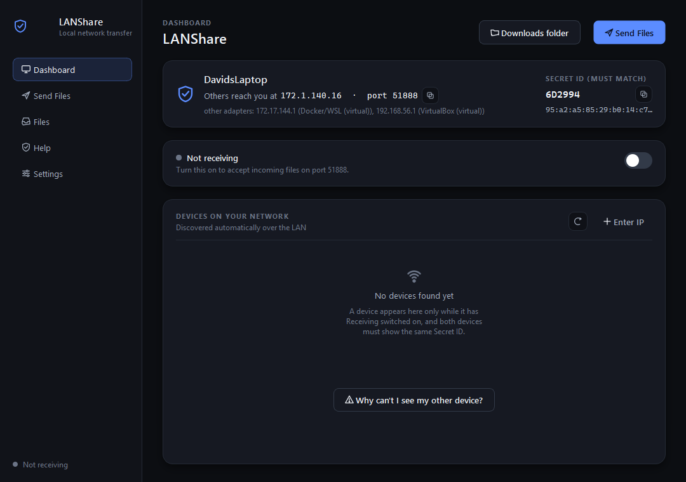
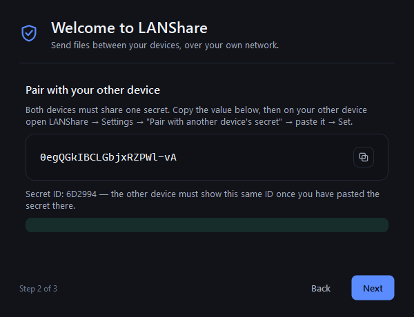
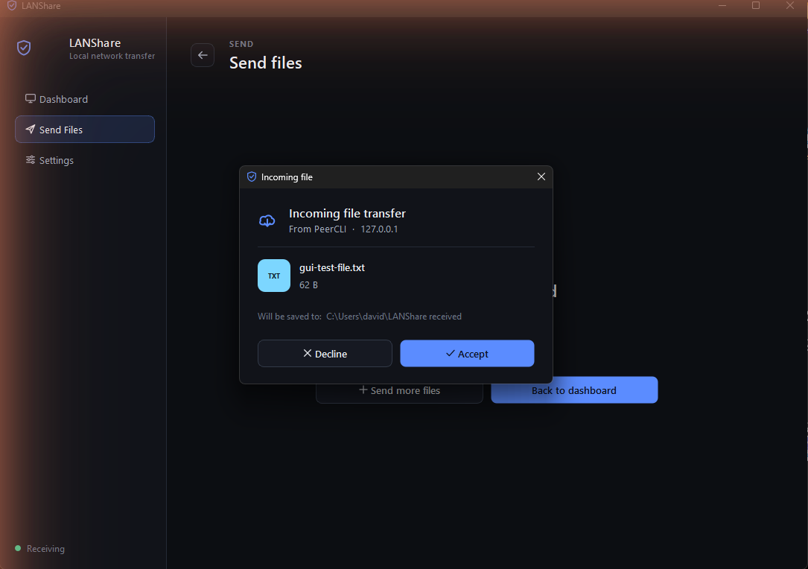
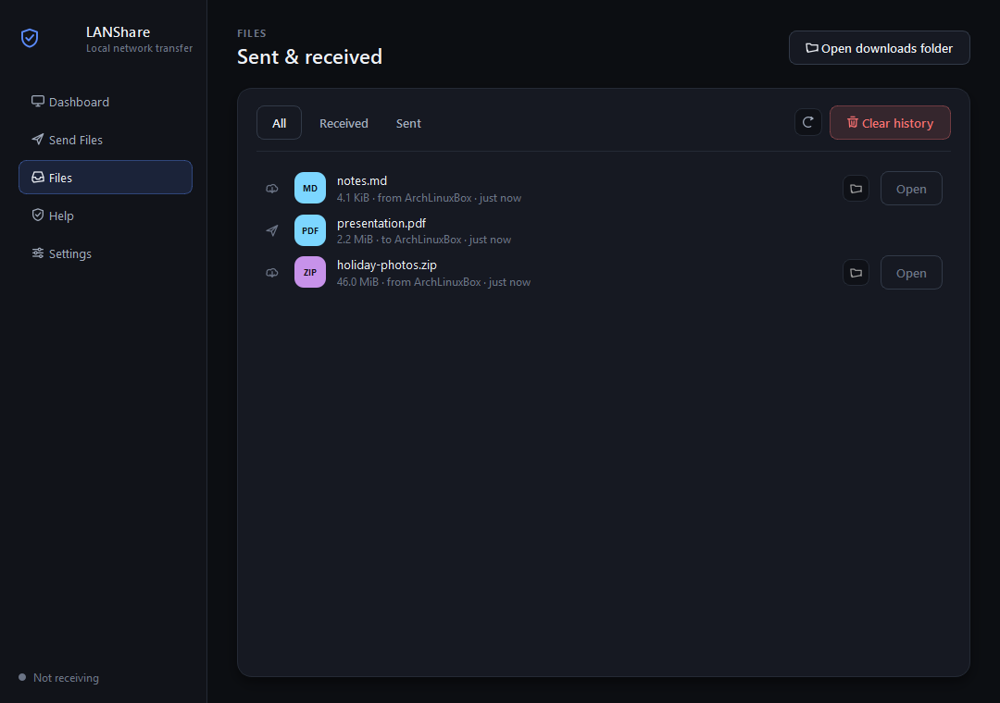
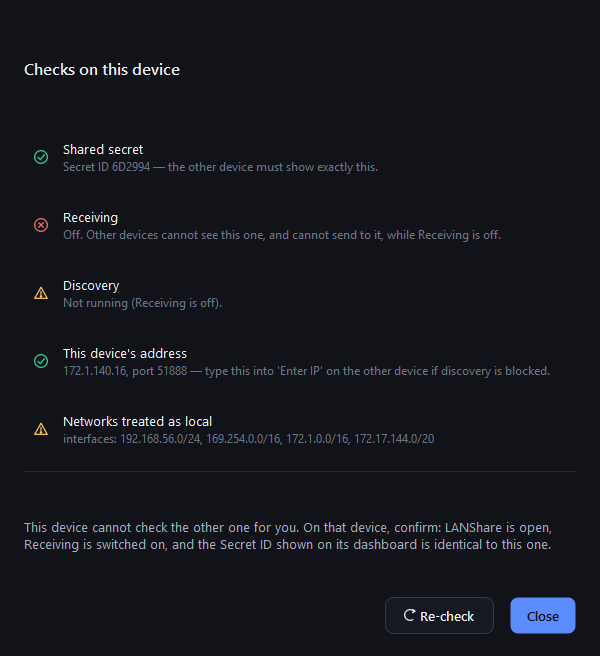
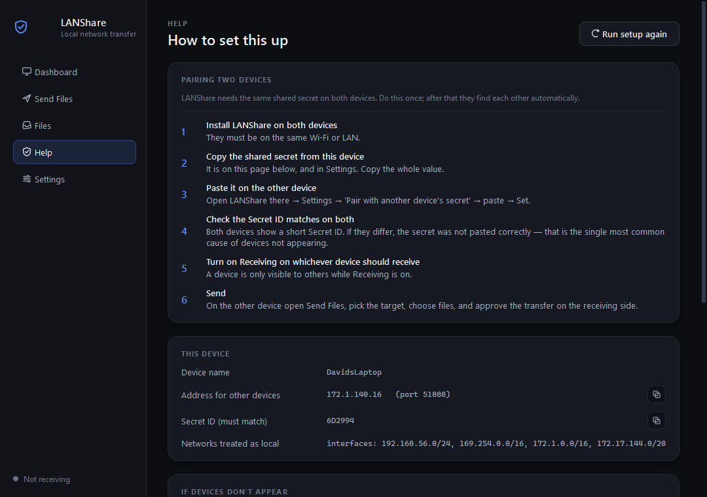

# LANShare

Send files straight from one of your computers to another over your own Wi-Fi — no cloud
account, no USB stick, no emailing things to yourself. Encrypted, and nothing is written until
the person on the receiving end says yes.

Works in every direction: Windows ⇄ Linux, Windows ⇄ Windows, Linux ⇄ Linux.

<p align="center">
  
</p>

---

# Set up in 5 minutes

You do this once. Afterwards the two machines find each other on their own.

The whole idea: **both devices need the same "shared secret"**. That's what proves they're
allowed to talk to each other. You generate it on one machine and paste it on the other.

## Step 1 — Install on your Windows PC

Open PowerShell in the folder you cloned this into:

```powershell
pip install -r requirements-gui.txt
python -m lanshare gui
```

The app opens and walks you through naming the device and generating your shared secret.

<p align="center">
  
</p>

**Copy that secret** — you need it in step 2. Note the **Secret ID** underneath it
(`6D2994` in the picture). You'll use that to check the other machine matches.

When you first switch **Receiving** on, Windows will ask whether to allow LANShare through the
firewall. **Say yes, for private networks.** If you miss the prompt, run this in an
Administrator PowerShell:

```powershell
New-NetFirewallRule -DisplayName "LANShare" -Direction Inbound -Protocol TCP -LocalPort 51888 -Action Allow -Profile Private
New-NetFirewallRule -DisplayName "LANShare discovery" -Direction Inbound -Protocol UDP -LocalPort 51889 -Action Allow -Profile Private
```

## Step 2 — Install on your Arch / Hyprland laptop

Arch won't let `pip` install into the system Python (that's PEP 668, and it's deliberate).
Everything LANShare needs is packaged, so use pacman and skip pip entirely:

```bash
sudo pacman -S --needed python-cryptography pyside6 qt6-wayland
python -m lanshare gui
```

> `qt6-wayland` is what lets the window open natively under Hyprland or Sway. Without it Qt
> falls back to XWayland, or fails with *"could not load the Qt platform plugin"*. If that
> still happens: `QT_QPA_PLATFORM=xcb python -m lanshare gui`.

Prefer a self-contained install instead? `./install.sh` builds a local `.venv` (no sudo), and
`./install.sh --desktop` also adds a launcher entry so LANShare shows up in wofi/rofi.

Now **paste the secret from step 1**: go to **Settings → "Pair with another device's secret"**
→ paste → **Set**.

## Step 3 — Check the Secret IDs match

Look at the top-right of the Dashboard on **both** machines. They must show the **same Secret
ID**:

```
SECRET ID (MUST MATCH)
6D2994
```

If they differ, the secret didn't paste correctly. Copy it again. This is by far the most
common reason two devices can't see each other.

## Step 4 — Turn on Receiving where you want files to land

Flip the **Receiving** switch on the Dashboard of whichever machine is receiving.

**A device is invisible to everyone while Receiving is off.** If your other computer isn't
showing up, this is the second thing to check.

## Step 5 — Send

On the other machine: **Send Files** → pick the device → choose your files → **Send**. The
receiving side gets a prompt showing who's sending, what the file is, and how big it is.
Nothing is written to disk until it's accepted.

<p align="center">
  
</p>

Everything that arrives — and everything you send — is listed under **Files**, with a button to
open it or show it in your file manager.

<p align="center">
  
</p>

---

# If the devices can't see each other

Click **"Why can't I see my other device?"** on the Dashboard. It checks everything it can from
this side and tells you what it found.

<p align="center">
  
</p>

| What you see | Usually means | Fix |
|---|---|---|
| "No devices found yet" | The other device has **Receiving off** | Turn Receiving on over there |
| Still nothing, both receiving | **Secret IDs differ** | Compare the Secret ID on both Dashboards; re-paste the secret |
| Nothing on Windows | **Firewall** blocked it | Allow LANShare on private networks (commands in step 1) |
| Nothing on guest/office Wi-Fi | Network **blocks broadcast** | Use **Enter IP** with the address on the other device's Dashboard |
| "not on a network this device recognises as local" | The two machines are on **different subnets** (e.g. one on Wi-Fi, one on Ethernet or a VPN) | `lanshare config --trust-network 192.168.1.0/24`, or turn the VPN off |
| Devices appear but transfers hang | The receiving side has a **prompt waiting** | Approve it — it auto-declines after 2 minutes |

**Which IP do I use?** The one labelled *"Others reach you at"* on the receiving device's
Dashboard. Ignore the greyed-out "other adapters" line — those are VirtualBox/WSL/Docker
adapters that other computers can't reach.

The **Help** page inside the app has all of this, plus this device's address, Secret ID, and the
exact firewall command for your OS.

<p align="center">
  
</p>

---

# Command line

The GUI and CLI share the same engine; anything you can do in one you can do in the other.

| Command | What it does |
|---|---|
| `lanshare gui` | Open the desktop app |
| `lanshare init [--name NAME]` | Generate this device's identity and a shared secret |
| `lanshare set-secret [SECRET]` | Paste the secret from your other device |
| `lanshare show-secret` | Print the secret and Secret ID for pairing |
| `lanshare info` | Device name, **the address to give others**, Secret ID, local networks |
| `lanshare receive` | Wait for incoming transfers (prompts for each file, or once per folder) |
| `lanshare send TARGET PATH...` | Send files or folders to an IP, or to a device name with `--find` |
| `lanshare discover` | List devices on the network |
| `lanshare config --trust-network CIDR` | Treat another subnet as local |
| `lanshare selftest` | Verify the install with a full loopback transfer |

Quick two-machine example:

```bash
# on the receiving machine
lanshare init --name desktop-bob     # prints the secret
lanshare receive

# on the sending machine
lanshare set-secret <the-secret>
lanshare send desktop-bob ./report.pdf --find
lanshare send desktop-bob ./holiday-photos --find   # whole folder, one prompt
```

A folder keeps its structure: the receiver recreates the tree inside its
download directory (as `holiday-photos`, or `holiday-photos (1)` if that name
is taken) and asks for approval once for the whole thing rather than once per
file. Symlinks inside a folder are skipped rather than followed. Sending a
folder needs the updated version on both devices; against an older receiver the
send is refused with a message saying so, and single files work as before.

## Install without the GUI

```bash
pip install -r requirements.txt        # CLI only, no Qt
```

On Debian 12+/Ubuntu 23.04+/Fedora 38+ (also PEP 668) use your distro's `python3-cryptography`
package, or `./install.sh --cli-only`.

---

# Where things are kept

| What | Windows | Linux/macOS |
|---|---|---|
| Settings, secret, identity key | `%APPDATA%\LANShare` | `~/.config/lanshare` |
| Transfer history (`history.jsonl`) | same folder | same folder |
| Received files (default) | `~\LANShare received` | `~/LANShare received` |

The history file records file names, sizes, and which device they came from, so the Files page
survives a restart. **Clear history** on that page deletes it; it never touches the files
themselves. Set `LANSHARE_HOME` to move the whole config directory.

---

# Security model

**Threat model:** other devices on the same LAN, including a malicious one that can see traffic
or try to connect to you.

What LANShare provides:

1. **Confidentiality & integrity in transit** — TLS 1.2+/1.3 encrypts the stream; a per-file
   SHA-256 is verified end-to-end.
2. **Mutual authentication** — both ends prove knowledge of the shared secret with an HMAC
   exchange over two random nonces. The HMAC also covers the receiver's certificate
   fingerprint, so an attacker who intercepts the connection (and therefore presents a
   *different* certificate) cannot produce a valid exchange even though they don't know the
   secret. This is the same channel-binding idea used by SCRAM.
3. **Authenticated discovery** — a query must carry an HMAC over the shared secret before it
   gets any answer, so the service does not disclose its hostname, port and fingerprint to
   unauthenticated devices, cannot be used as a reflection amplifier, and cannot be
   impersonated by a forged reply. When you send to a device found this way, its TLS
   certificate is checked against the advertised fingerprint *before* authenticating.
4. **Trust on first use (TOFU)** — the sender pins each receiver's certificate fingerprint and
   warns if a known device name later presents a different one. Be aware of what this does and
   does not buy you: the device name is self-reported, so a determined attacker who already has
   your shared secret can simply claim a name you have never seen and be trusted on first use.
   TOFU here reliably catches accidental key changes (a reinstall) rather than a deliberate
   impersonator.
5. **Explicit consent** — nothing is written without the receiving user saying yes (outside
   `--yes` test mode). The prompt shows the sanitized name that will actually be written, with
   invisible and text-direction characters stripped so an executable cannot be dressed up as an
   image.
6. **Network scoping** — a peer is accepted only if it is loopback, link-local, RFC1918/ULA, or
   **inside a network this machine actually has an interface on**. Testing only for "private
   range" is a common shortcut and it is wrong: a real home Wi-Fi hands out `172.1.140.16/16`,
   which is public address space, and the shortcut refused every peer on the user's own network.
   Genuinely remote hosts are still refused.
7. **Abuse resistance** — connections are handled concurrently (one silent peer cannot starve
   the receiver), bounded to a fixed number of slots, and repeated authentication failures from
   an address earn a cooldown.
8. **Safe file handling** — untrusted file names are reduced to a sanitized base name (no
   directories, no `..`, no control characters, no bidirectional/zero-width characters, no
   Windows reserved device names, length-capped); the destination is verified to resolve inside
   the download directory and is claimed atomically with `O_EXCL`, so existing files are never
   overwritten (`name (1).ext`) even under concurrency; declared sizes are checked against a
   configurable ceiling and free disk space; incoming bytes are written to a temp file and
   atomically renamed only after the hash checks out.

Honest limitations (it's "reasonably secure", not a hardened product):

- The shared secret and TLS private key are stored on disk. On POSIX they're created `0600`
  from the first byte inside a `0700` directory; on Windows they rely on your user profile's ACL.
- Certificates are self-signed; identity trust is TOFU + the shared secret, not a CA. A
  brand-new device is trusted the first time you talk to it.
- Anyone who knows your shared secret can *offer* you files (you still approve each one) and,
  if they also run a receiver, receive from you. Rotate the secret if it leaks.
- **This is not a PAKE.** Authenticating necessarily reveals an HMAC computed with the shared
  secret, so anyone who can get you to connect to them can attack that transcript *offline*.
  With the generated secret (~128 bits) that is hopeless for them; with a short human-chosen
  one it is not. Prefer the generated value — `set-secret` requires at least 12 characters, but
  length alone is not strength.
- The **Secret ID** shown in the UI is a truncated hash, for eyeballing that two devices match.
  It is deliberately never transmitted; putting it on the network would give an eavesdropper an
  offline check against guessed secrets.
- Failed authentication is rate-limited per address, which blunts online guessing, but there is
  no account lockout or audit trail. It's built for a home/office LAN, not a hostile network.
- IPv4 only. On an IPv6-only network it will not find or reach peers.

---

# Development

```bash
python tests/test_lanshare.py   # or: pytest -q
python -m lanshare selftest     # full loopback transfer, no second machine needed
```

# License

MIT
