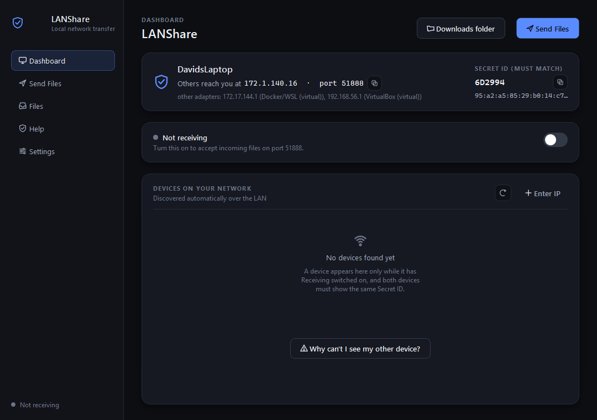
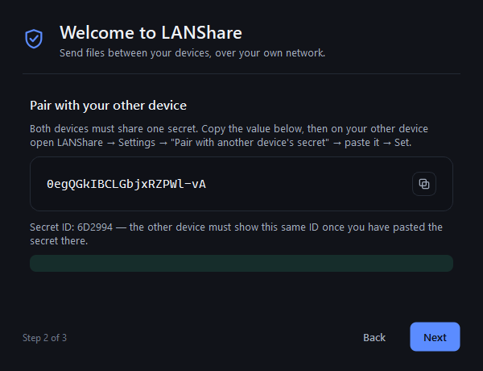
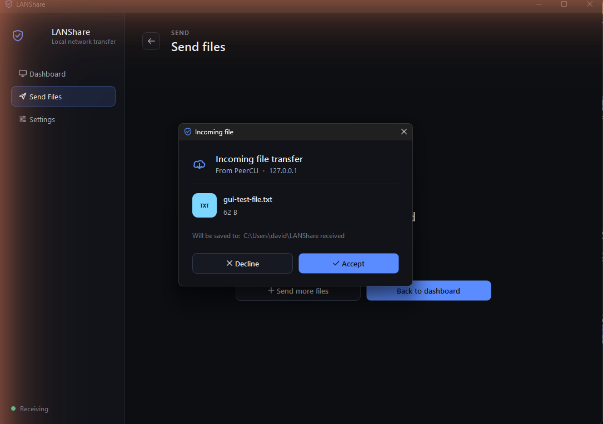
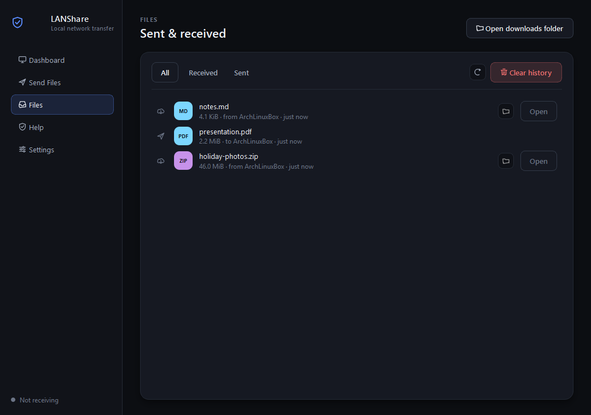

<div align="center">

# LANShare

**Send files straight from one of your computers to another over your own Wi-Fi.**
No cloud account, no USB stick, no emailing things to yourself.

Encrypted end-to-end, and nothing is written to disk until the person on the
receiving end says *yes*.

Works in every direction: **Windows ⇄ Linux**, **Windows ⇄ Windows**, **Linux ⇄ Linux**.



</div>

---

## Contents

- [What it is](#what-it-is)
- [Quick start (5 minutes)](#quick-start-5-minutes)
- [Documentation](#documentation)
- [Command line](#command-line)
- [Troubleshooting](#troubleshooting)
- [Where things are kept](#where-things-are-kept)
- [Security model](#security-model)
- [Development & building](#development--building)
- [License](#license)

---

## What it is

LANShare is a small, self-contained tool for moving files between two computers
on the **same local network**. It has a desktop GUI (PySide6/Qt) and a
command-line interface that share one engine — anything you can do in one, you
can do in the other.

The design goals, in order:

1. **It just works across OSes.** A Windows desktop and an Arch/Hyprland laptop
   should find each other and transfer a folder without you editing a config
   file.
2. **It's reasonably secure by default.** Every transfer is encrypted, mutually
   authenticated from a shared secret using a PAKE, and explicitly approved on
   the receiving end. See [Security model](#security-model).
3. **It explains itself.** When two devices can't see each other — the normal
   failure on real networks — the app tells you *why*, from the side that can
   actually check.

| | |
|---|---|
| **Status** | `1.0.0a1` — alpha. Usable, tested, not yet code-signed. |
| **Transport** | TCP `51888` (TLS), UDP `51889` (discovery) |
| **Requires** | Python 3.8+ · `cryptography` · `spake2` · `PySide6` (GUI only) |
| **Platforms** | Windows, Linux, macOS (IPv4 LANs) |

---

## Quick start (5 minutes)

You do this once. Afterwards the two machines find each other on their own.

> **The one idea that matters:** both devices need the **same shared secret**.
> That's what proves they're allowed to talk to each other. You generate it on
> one machine and paste it on the other. The app shows a short **Secret ID**
> (e.g. `6D2994`) on each device so you can eyeball that they match.

### 1. Install & launch on the first machine

**Windows, the easy way (alpha build):** download
`LANShare-1.0.0a1-windows-amd64.zip`, unzip anywhere, double-click
`LANShare.exe`. Nothing to install — Python and Qt are inside the `.exe`. The
unsigned alpha triggers *“Windows protected your PC”* the first time: click
**More info → Run anyway**.

**From source (any OS):**

```bash
pip install -r requirements-gui.txt
python -m lanshare gui
```

The app opens a wizard that names the device and generates your shared secret.

<div align="center">
  
</div>

**Copy that secret** — you need it on the second machine.

### 2. Install & launch on the second machine

On Arch / Hyprland (or any PEP 668 distro that blocks `pip` into system Python),
use the packaged libraries:

```bash
sudo pacman -S --needed python-cryptography pyside6 qt6-wayland
python -m lanshare gui
```

Prefer an isolated install with no `sudo`? `./install.sh` builds a local `.venv`;
`./install.sh --desktop` also adds a wofi/rofi launcher entry.

Then **paste the secret**: **Settings → “Pair with another device’s secret” →
paste → Set**.

### 3. Confirm the Secret IDs match

Top-right of the Dashboard on **both** machines must show the same value:

```
SECRET ID (MUST MATCH)
6D2994
```

If they differ, the secret didn’t paste cleanly — copy it again. This is by far
the most common reason two devices can’t see each other.

### 4. Turn on Receiving where files should land

Flip the **Receiving** switch on the Dashboard of the receiving machine.

> **A device is invisible to everyone while Receiving is off.** If the other
> computer isn’t showing up, this is the second thing to check.

On Windows, the first time you enable Receiving, allow LANShare through the
firewall **for private networks**. Missed the prompt? In an admin PowerShell:

```powershell
New-NetFirewallRule -DisplayName "LANShare" -Direction Inbound -Protocol TCP -LocalPort 51888 -Action Allow -Profile Private
New-NetFirewallRule -DisplayName "LANShare discovery" -Direction Inbound -Protocol UDP -LocalPort 51889 -Action Allow -Profile Private
```

### 5. Send

On the other machine: **Send Files → pick the device → choose files → Send.**
The receiving side gets a prompt showing who’s sending, the file name, and the
size. **Nothing touches disk until it’s accepted.**

<div align="center">
  
</div>

Everything sent and received is listed under **Files**, with buttons to open it
or reveal it in your file manager.

<div align="center">
  
</div>

---

## Documentation

Longer guides live in [`docs/`](docs/):

| Page | What’s in it |
|---|---|
| **[Usage guide](docs/USAGE.md)** | The full how-to: install, pair, send files and folders, every CLI command, settings, and recovery steps. Start here if the quick start wasn’t enough. |
| **[Troubleshooting](docs/USAGE.md#troubleshooting)** | Symptom → cause → fix for every “they can’t see each other” case. |
| **[The journey](docs/JOURNEY.md)** | How LANShare was built, commit by commit — the bugs that shaped it (a “private IP” check that broke on real Wi-Fi, an `O(N²)` history writer) and how the security model grew from HMAC to SPAKE2 + scrypt. |

---

## Command line

The GUI and CLI share the same engine.

| Command | What it does |
|---|---|
| `lanshare gui` | Open the desktop app |
| `lanshare init [--name NAME]` | Generate this device’s identity and a shared secret |
| `lanshare set-secret [SECRET]` | Paste the secret from your other device |
| `lanshare show-secret` | Print the secret and Secret ID for pairing |
| `lanshare info` | Device name, **the address to give others**, Secret ID, local networks |
| `lanshare receive` | Wait for incoming transfers (one prompt per file, or once per folder) |
| `lanshare send TARGET PATH...` | Send files/folders to an IP, or a device name with `--find` |
| `lanshare discover` | List devices on the network |
| `lanshare config --trust-network CIDR` | Treat another subnet as local |
| `lanshare selftest` | Verify the install with a full loopback transfer |

A quick two-machine run:

```bash
# receiving machine
lanshare init --name desktop-bob     # prints the secret
lanshare receive

# sending machine
lanshare set-secret <the-secret>
lanshare send desktop-bob ./report.pdf --find
lanshare send desktop-bob ./holiday-photos --find   # whole folder, one prompt
```

A folder keeps its structure: the receiver recreates the tree inside its
download directory (as `holiday-photos`, or `holiday-photos (1)` if taken) and
asks for approval **once** for the whole thing. Symlinks inside a folder are
skipped rather than followed.

**CLI only, no GUI:**

```bash
pip install -r requirements.txt    # cryptography + spake2, no Qt
```

On PEP 668 distros use your distro’s `python3-cryptography`, or
`./install.sh --cli-only`.

Full reference: **[docs/USAGE.md](docs/USAGE.md)**.

---

## Troubleshooting

Click **“Why can’t I see my other device?”** on the Dashboard — it checks
everything it can from this side and reports what it found.

<div align="center">
  
</div>

| What you see | Usually means | Fix |
|---|---|---|
| “No devices found yet” | The other device has **Receiving off** | Turn Receiving on there |
| Nothing, both receiving | **Secret IDs differ** | Compare both Dashboards; re-paste the secret |
| Nothing on Windows | **Firewall** blocked it | Allow LANShare on private networks (step 4) |
| Nothing on guest/office Wi-Fi | Network **blocks broadcast** | Use **Enter IP** with the other device’s address |
| “not on a network this device recognises as local” | Devices on **different subnets** (Wi-Fi vs Ethernet/VPN) | `lanshare config --trust-network 192.168.1.0/24`, or drop the VPN |
| Devices appear but transfers hang | A **prompt is waiting** on the receiver | Approve it (auto-declines after 2 min) |

**Which IP?** The one labelled *“Others reach you at”* on the receiving device’s
Dashboard. Ignore the greyed-out “other adapters” — those are
VirtualBox/WSL/Docker interfaces other computers can’t reach. The in-app
**Help** page shows this device’s address, Secret ID, and the exact firewall
command for your OS.

---

## Where things are kept

| What | Windows | Linux/macOS |
|---|---|---|
| Settings, secret, identity key | `%APPDATA%\LANShare` | `~/.config/lanshare` |
| Transfer history (`history.jsonl`) | same folder | same folder |
| Received files (default) | `~\LANShare received` | `~/LANShare received` |

The history file records file names, sizes, and the peer they came from, so the
Files page survives a restart. **Clear history** deletes it and never touches
the files themselves. Set `LANSHARE_HOME` to relocate the whole config directory.

---

## Security model

**Threat model:** other devices on the same LAN, including a malicious one that
can see traffic or try to connect to you.

What LANShare provides:

1. **Confidentiality & integrity in transit.** TLS encrypts the stream and a
   per-file SHA-256 is verified end-to-end. TLS 1.3 is used whenever both peers
   support it, with TLS 1.2 as the floor; on 1.2 the cipher list is pinned to
   forward-secret AEAD suites (ECDHE + AES-GCM / ChaCha20-Poly1305), so a legacy
   static-RSA or CBC suite can never be negotiated.
2. **Mutual authentication with a PAKE.** Both ends run a **SPAKE2**
   password-authenticated key exchange over the shared secret, then confirm the
   derived key. SPAKE2’s defining property: observing — or even taking part in —
   a run reveals *nothing* that speeds up guessing the secret offline. An
   impostor gets one online guess per connection (rate-limited); a passive
   eavesdropper gets nothing. The key-confirmation MAC also binds the receiver’s
   TLS certificate fingerprint, so a man-in-the-middle presenting a different
   certificate can’t complete the handshake — channel binding, on top of a PAKE.
3. **Authenticated discovery.** A discovery query must carry a valid HMAC before
   it gets any answer, so the service won’t disclose its hostname/port/fingerprint
   to strangers, can’t be used as a reflection amplifier, and can’t be
   impersonated by a forged reply. The HMAC is keyed on a **scrypt-stretched**
   form of the secret (derived once, cached), so a captured discovery packet is
   expensive to attack offline rather than cheap. When you send to a discovered
   device, its TLS certificate is checked against the advertised fingerprint
   *before* authenticating.
4. **Trust on first use (TOFU).** The sender pins each receiver’s fingerprint and
   warns if a known device name later presents a different one — reliably
   catching an accidental key change (a reinstall).
5. **Explicit consent.** Nothing is written without the receiving user saying yes
   (outside `--yes` test mode). The prompt shows the sanitized name that will
   actually be written, with invisible and text-direction characters stripped so
   an executable can’t be dressed up as an image.
6. **Network scoping.** A peer is accepted only if it’s loopback, link-local,
   RFC1918/ULA, or **inside a network this machine actually has an interface on**
   — which correctly accepts real-world LANs that hand out public-range addresses,
   while still refusing genuinely remote hosts.
7. **Abuse resistance.** Connections are handled concurrently (one silent peer
   can’t starve the receiver), bounded to a fixed number of slots, and repeated
   auth failures from an address earn a cooldown.
8. **Safe file handling.** Untrusted names are reduced to a sanitized base name
   (no directories, no `..`, no control/bidi/zero-width characters, no Windows
   reserved names, length-capped); the destination is proven to resolve inside
   the download directory and claimed atomically with `O_EXCL` (never
   overwriting — `name (1).ext`); sizes are checked against a ceiling and free
   space; bytes land in a temp file and are renamed only after the hash matches.

**Honest limitations** (“reasonably secure”, not a hardened product):

- The secret and TLS private key live on disk — `0600` inside a `0700` directory
  on POSIX; on Windows they rely on the per-user profile ACL.
- Certificates are self-signed; identity trust is TOFU + the secret, not a CA.
- Anyone with your secret can *offer* you files (you still approve each) and, if
  they run a receiver, receive from you. Rotate the secret if it leaks.
- The handshake (SPAKE2) leaks no offline-guessable material, and discovery
  stretches its HMAC key with scrypt — but scrypt *slows* a guessing search, it
  doesn’t stop one. Prefer the generated secret; `set-secret` requires ≥12
  characters, but length alone isn’t strength.
- Failed auth is rate-limited per address, but there’s no lockout or audit trail.
  Built for a home/office LAN, not a hostile network.
- IPv4 only. On an IPv6-only network it won’t find or reach peers.

The full story of how this model evolved is in **[docs/JOURNEY.md](docs/JOURNEY.md)**.

---

## Development & building

```bash
python tests/test_lanshare.py   # or: pytest -q   (65 tests)
python -m lanshare selftest     # full loopback transfer, no second machine
```

CI runs the suite **and** the loopback self-test on every push and pull request
across Python 3.8–3.12 on Linux, Windows and macOS
(`.github/workflows/ci.yml`).

### Standalone executables (Windows alpha)

Whatever interpreter you build with is what gets bundled, so build in a clean
venv:

```powershell
python -m venv .venv-build
.\.venv-build\Scripts\pip install PySide6 cryptography spake2 pyinstaller
.\.venv-build\Scripts\python packaging\build.py --clean
```

Produces, in `dist/`:

| File | What it is |
|---|---|
| `LANShare.exe` | the desktop GUI, windowed, ~51 MB |
| `lanshare-cli.exe` | the same tool for the command line, ~13 MB |
| `LANShare-<version>-windows-amd64.zip` | both, plus tester instructions |
| `SHA256SUMS.txt` | checksums for all three |

The app icon is generated from the same QPainter shield the GUI draws
(`packaging/make_icon.py`) — no artwork file to keep in sync. One gotcha if you
touch `packaging/lanshare.spec`: the two executables must not differ only by
case (`LANShare.exe` vs `lanshare.exe` collide on case-insensitive Windows
paths).

---

## License

MIT
