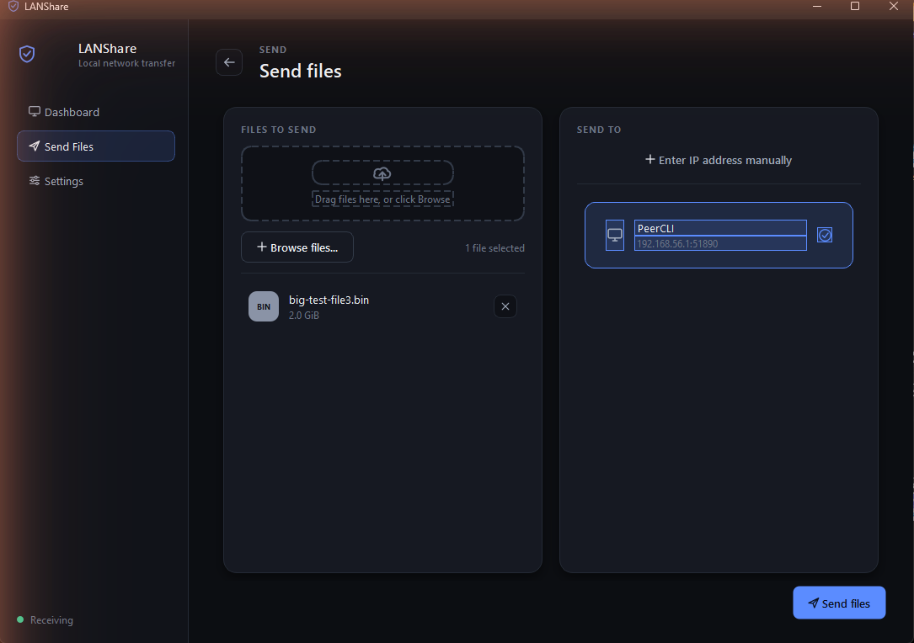
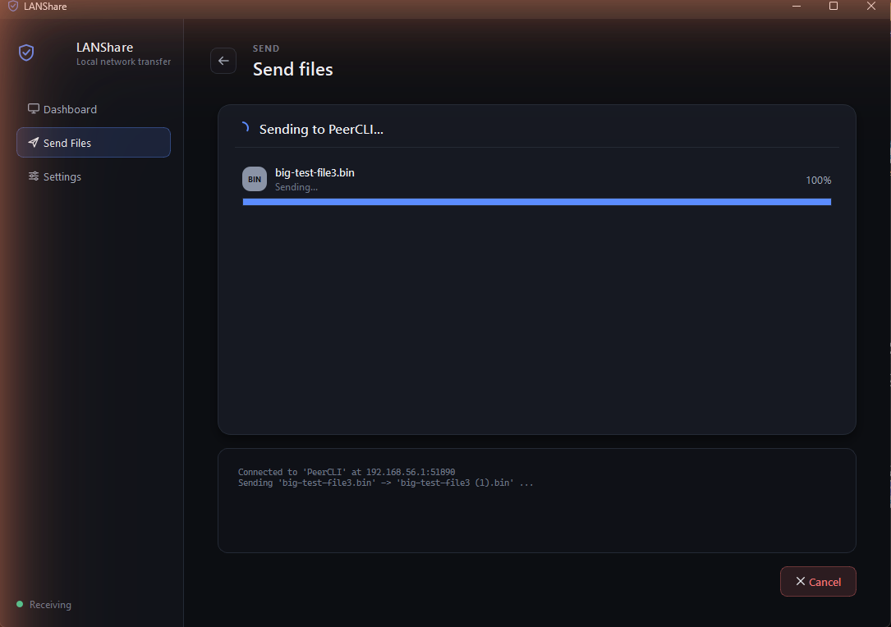
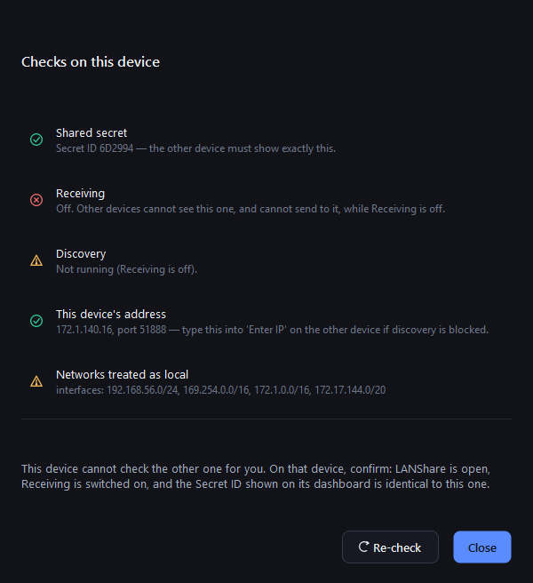

# LANShare — Usage Guide

Everything you need to install LANShare, pair two devices, and move files
between them. If you just want the 5-minute version, the
[README quick start](../README.md#quick-start-5-minutes) is shorter; this page
is the complete reference.

- [Concepts](#concepts)
- [Installing](#installing)
- [Pairing two devices](#pairing-two-devices)
- [Sending files](#sending-files)
- [Sending folders](#sending-folders)
- [Receiving files](#receiving-files)
- [Settings](#settings)
- [The command line](#the-command-line)
- [Troubleshooting](#troubleshooting)
- [Uninstalling & resetting](#uninstalling--resetting)
- [FAQ](#faq)

---

## Concepts

A few terms show up throughout the app and this guide:

| Term | What it means |
|---|---|
| **Shared secret** | A pairing passphrase that must be **identical on both devices**. It’s how they prove they’re allowed to talk. Generate it once, paste it on the other machine. |
| **Secret ID** | A short 6-character fingerprint of the secret (e.g. `6D2994`), shown on each Dashboard so you can confirm both sides match **without** comparing the full secret. It is never sent over the network. |
| **Receiving** | A switch on each device. While it’s **on**, the device listens for transfers and is discoverable. While it’s **off**, the device is invisible and accepts nothing. |
| **Device fingerprint** | A hash of a device’s TLS certificate — its stable cryptographic identity. The sender remembers it (trust on first use) and warns if it ever changes. |
| **Download directory** | Where received files land. Defaults to `~/LANShare received`. |

**The mental model:** pair once (same secret on both), turn Receiving on where
files should land, then send from the other side and approve the prompt.

---

## Installing

LANShare needs **Python 3.8+**. The GUI additionally needs **PySide6** (Qt). The
engine needs **`cryptography`** (TLS identity) and **`spake2`** (the PAKE
handshake); both install automatically with the commands below.

### Windows

**Prebuilt (recommended for the alpha):** download
`LANShare-1.0.0a1-windows-amd64.zip`, unzip anywhere, run `LANShare.exe`. Python
and Qt are bundled. The unsigned alpha shows *“Windows protected your PC”* on
first run — click **More info → Run anyway**.

**From source:**

```powershell
pip install -r requirements-gui.txt
python -m lanshare gui
```

### Linux

**Arch / Hyprland / Sway** — use the packaged libraries (the system Python is
PEP-668 locked):

```bash
sudo pacman -S --needed python-cryptography pyside6 qt6-wayland
python -m lanshare gui
```

`qt6-wayland` is what lets the window open natively on Wayland. Without it Qt
falls back to XWayland or errors with *“could not load the Qt platform plugin”*.
If that happens anyway:

```bash
QT_QPA_PLATFORM=xcb python -m lanshare gui
```

**Debian 12+ / Ubuntu 23.04+ / Fedora 38+** (also PEP 668): install
`python3-cryptography` (and `python3-pyside6` for the GUI) from your distro, or
use the self-contained installer below.

**Self-contained venv (no `sudo`):**

```bash
./install.sh             # CLI + GUI into a local .venv
./install.sh --cli-only  # no Qt
./install.sh --desktop   # also add a wofi/rofi launcher entry
```

### CLI only, any OS

```bash
pip install -r requirements.txt   # cryptography + spake2, no Qt
python -m lanshare info
```

### Verify the install

```bash
python -m lanshare selftest
```

This runs a complete transfer against a throwaway receiver on `127.0.0.1` —
TLS, the PAKE handshake, approval, safe write, and checksum verification — so a
pass means the whole stack works on this machine. It never touches your real
config.

---

## Pairing two devices

1. **Generate the secret on device A.**
   - GUI: the first-run wizard creates it. See it again under **Settings**.
   - CLI: `lanshare init` prints it.
2. **Copy the secret to device B.**
   - GUI: **Settings → “Pair with another device’s secret” → paste → Set**.
   - CLI: `lanshare set-secret <the-secret>` (or run it with no argument to be
     prompted without echoing).
3. **Confirm the Secret IDs match.** Both Dashboards show the same 6 characters
   under `SECRET ID (MUST MATCH)`. If they differ, the paste was imperfect —
   redo it.

> Secrets must be at least 12 characters, and the **generated** value (~128 bits
> of entropy) is far stronger than anything hand-typed. Prefer it.

To **rotate** the secret (e.g. if it leaked): set a new one on every device.
Devices with mismatched secrets simply stop seeing each other — there’s no error
to chase, which is exactly why the Secret ID exists.

---

## Sending files

**GUI:**

1. Open **Send Files**.
2. Pick the destination device from the discovered list, or click **Enter IP**
   and type the address shown as *“Others reach you at”* on the receiver.
3. Choose one or more files.
4. **Send.** Watch per-file progress; the receiver approves first.

<div align="center">
  
</div>

**CLI:**

```bash
# to an IP address
lanshare send 192.168.1.42 ./report.pdf ./photo.jpg

# to a device by name (located via discovery)
lanshare send desktop-bob ./report.pdf --find

# to a non-default port
lanshare send 192.168.1.42 ./report.pdf --port 51890
```

Each file is hashed, offered, approved, streamed over TLS, and then verified by
SHA-256 on both ends. The command exits non-zero if any file wasn’t delivered.

---

## Sending folders

Send a folder exactly like a file — select it in the GUI, or pass its path to
`lanshare send`. LANShare transfers the **whole tree as one batch**:

- The receiver is prompted **once** for the entire folder (not once per file).
- The directory structure is recreated inside the download directory, as
  `my-folder` — or `my-folder (1)` if that name is already taken, with the tree
  intact rather than collision suffixes scattered over every file.
- **Symlinks inside the folder are skipped**, not followed — a link could point
  outside what you selected.
- Empty folders are reported and skipped; one empty folder won’t abandon the
  rest of a multi-item send.

```bash
lanshare send desktop-bob ./holiday-photos --find
```

> Folder transfers need the current protocol on **both** devices. Against an
> older receiver the folder send is refused with a clear message; single files
> still work.

---

## Receiving files

**GUI:** flip **Receiving** on. When a transfer arrives you get a prompt showing
the sender, the (sanitized) name, and the size. Approve or decline. Approved
files land in your download directory and appear under **Files**.

<div align="center">
  
</div>

**CLI:**

```bash
lanshare receive                     # prompts for each file / once per folder
lanshare receive --dir ~/Downloads   # override where files land for this run
lanshare receive --no-discovery      # listen, but don't answer discovery
lanshare receive --yes               # auto-accept EVERYTHING — testing only
```

> `--yes` accepts every incoming transfer without asking. Only use it on a
> network you fully trust, for testing.

Key facts about receiving:

- **A device is invisible while Receiving is off.** Nothing is discoverable and
  nothing is accepted.
- **Nothing is written until you approve.** Bytes stream to a temp file and are
  renamed into place only after the checksum matches.
- An unanswered prompt **auto-declines after 2 minutes** so a sender isn’t left
  hanging forever.

---

## Settings

Available in the GUI **Settings** page and via `lanshare config`:

| Setting | CLI | Notes |
|---|---|---|
| Device name | `--name` | What other devices show for you |
| Download directory | `--dir` | Where received files land |
| TCP port | `--port` | Default `51888` |
| Max file size | `--max-size 20G` | Ceiling on accepted files (`500M`, `20GiB`, …) |
| Discovery on/off | `--discovery on\|off` | Whether you answer LAN discovery |
| Trust a subnet | `--trust-network 192.168.1.0/24` | Treat another subnet as local |
| Forget trusted subnets | `--untrust-all-networks` | |

```bash
lanshare config --name laptop-anna --dir ~/Inbox --max-size 10G
lanshare info     # review everything, including the address to give others
```

---

## The command line

| Command | What it does |
|---|---|
| `lanshare gui` | Open the desktop app |
| `lanshare init [--name NAME]` | Generate this device’s identity + a shared secret |
| `lanshare set-secret [SECRET]` | Set/paste the shared secret (prompted if omitted) |
| `lanshare show-secret` | Print the secret and Secret ID |
| `lanshare info` | Name, address to give others, Secret ID, local networks |
| `lanshare config [...]` | View or change persistent settings (table above) |
| `lanshare receive [...]` | Run the receiver and wait for transfers |
| `lanshare send TARGET PATH...` | Send files/folders (IP, or name with `--find`) |
| `lanshare discover [--timeout N]` | List receivers on the network |
| `lanshare selftest` | Full loopback transfer self-test |
| `lanshare --version` | Print the version |

Every command supports `-h/--help`.

---

## Troubleshooting

Start with the Dashboard’s **“Why can’t I see my other device?”** — it runs the
checks below from the side that can actually see the answer.

<div align="center">
  
</div>

| Symptom | Cause | Fix |
|---|---|---|
| “No devices found yet” | Other device has **Receiving off** | Turn Receiving on there |
| Nothing, both receiving | **Secret IDs differ** | Compare both Dashboards; re-paste the secret |
| Nothing on Windows | **Firewall** blocked it | Allow LANShare on **private** networks (see below) |
| Nothing on guest/office/hotel Wi-Fi | Network **blocks UDP broadcast** | Use **Enter IP** / `lanshare send <ip>` instead of discovery |
| “not on a network this device recognises as local” | The two machines are on **different subnets** (Wi-Fi vs Ethernet, or a VPN) | `lanshare config --trust-network 192.168.1.0/24`, or turn the VPN off |
| Devices appear, transfer hangs | A **prompt is waiting** on the receiver | Approve it (auto-declines after 2 min) |
| “device presented a NEW identity” warning | Peer’s certificate changed | Expected after a reinstall; otherwise verify it’s really them before continuing |

### Windows firewall

Allow the two ports on private networks (admin PowerShell):

```powershell
New-NetFirewallRule -DisplayName "LANShare" -Direction Inbound -Protocol TCP -LocalPort 51888 -Action Allow -Profile Private
New-NetFirewallRule -DisplayName "LANShare discovery" -Direction Inbound -Protocol UDP -LocalPort 51889 -Action Allow -Profile Private
```

### Which IP address do I use?

The one labelled **“Others reach you at”** on the receiving device’s Dashboard
(or the first address from `lanshare info`). Ignore greyed-out “other adapters”
— those are VirtualBox/WSL/Docker/VPN interfaces other computers can’t reach.

### When discovery just won’t work

Some networks (guest/corporate Wi-Fi, client isolation) block the UDP broadcast
discovery relies on. The transfer itself is ordinary TCP and still works — skip
discovery and connect directly by IP:

```bash
lanshare send 192.168.1.42 ./file.pdf     # no --find
```

---

## Uninstalling & resetting

LANShare keeps everything in one directory:

| Platform | Config directory |
|---|---|
| Windows | `%APPDATA%\LANShare` |
| Linux/macOS | `~/.config/lanshare` |

Delete that directory to reset the device completely (secret, identity,
settings, history). Received **files** live in your download directory and are
never touched by this. To relocate the config directory, set the
`LANSHARE_HOME` environment variable before launching.

To remove the app: delete the unzipped `LANShare.exe` folder (Windows prebuilt),
remove the `.venv` created by `install.sh`, or `pip uninstall lanshare`.

---

## FAQ

**Does anything go through the internet or a cloud service?**
No. Transfers are directly between the two machines on your LAN. There is no
account and no server.

**Can I use it between two machines on different Wi-Fi networks?**
Not across the open internet — it’s LAN-only by design. Two subnets of the
*same* network work once you trust the other subnet
(`--trust-network`). A VPN that puts both machines on one virtual LAN can work
too; add that network the same way.

**Is it safe on public/office Wi-Fi?**
Transfers are encrypted and authenticated, so the *content* is protected even on
a shared network. But it’s built for a home/office LAN, not a hostile one — see
the [Security model](../README.md#security-model) and its honest limitations.

**Why can’t the other device see me?**
99% of the time: Receiving is off over there, or the Secret IDs don’t match, or
a firewall/broadcast-blocking network. Walk the table above in that order.

**Where did this come from / how was it built?**
See [the journey](JOURNEY.md).
